# InventoryManager: 本（または自分の所有物）を管理する Androidアプリケーション

InventoryManagerは、本やその他の所有物を管理するAndroidアプリケーションです。

## スクリーンショット

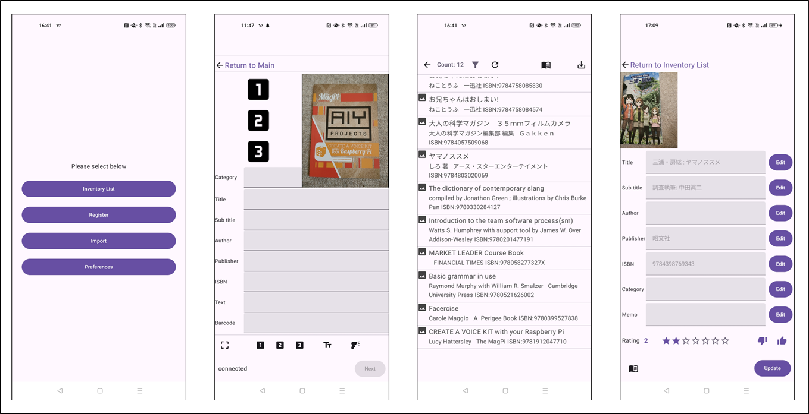

## 機能概要

* アイテムの登録
    * アイテムの登録
    * カメラを使った書影の記録、バーコードの読み出し、文字認識
* 登録データの管理
    * 登録したアイテムの一覧表示
    * 一覧のフィルタリング
    * 登録データの詳細確認、メモやレーティングの記録
    * アイテムのISBN番号を使って国立国会図書館に登録されている情報で更新
* データのインポート/エクスポート
    * 登録した全データのエクスポート
    * エクスポートしたデータのインポート

## インストール

（インストール方法は、現在検討中です）

## 画面遷移

以下に画面遷移を示します。アプリ起動直後は、メイン画面を表示します。

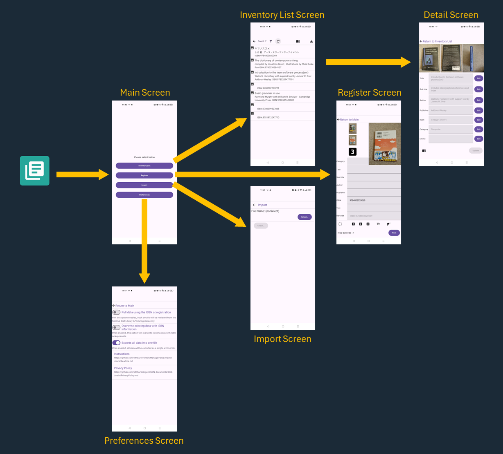

使用する機能によって、画面を選択してください。

## 画面説明

### メイン画面 (Main Screen)

起動直後に表示する画面です。各画面に遷移する起点の画面です。

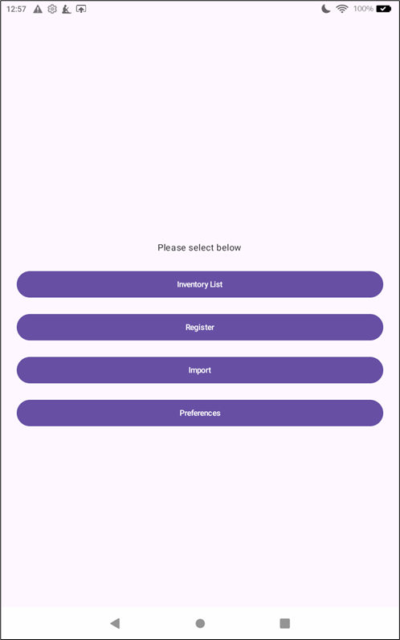

### 一覧画面 (Inventory List Screen)

登録済のデータ一覧を表示する画面です。

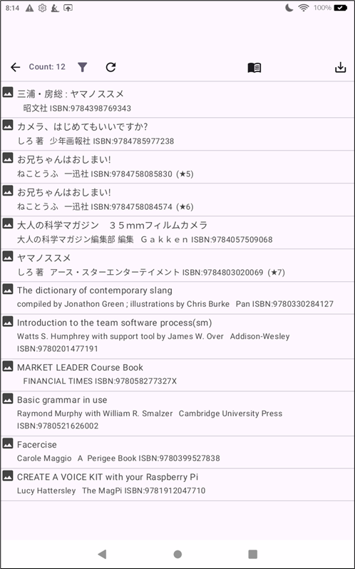

リストをタッチすると、詳細画面に遷移します。『←』ボタンで、メイン画面に戻ることができます。

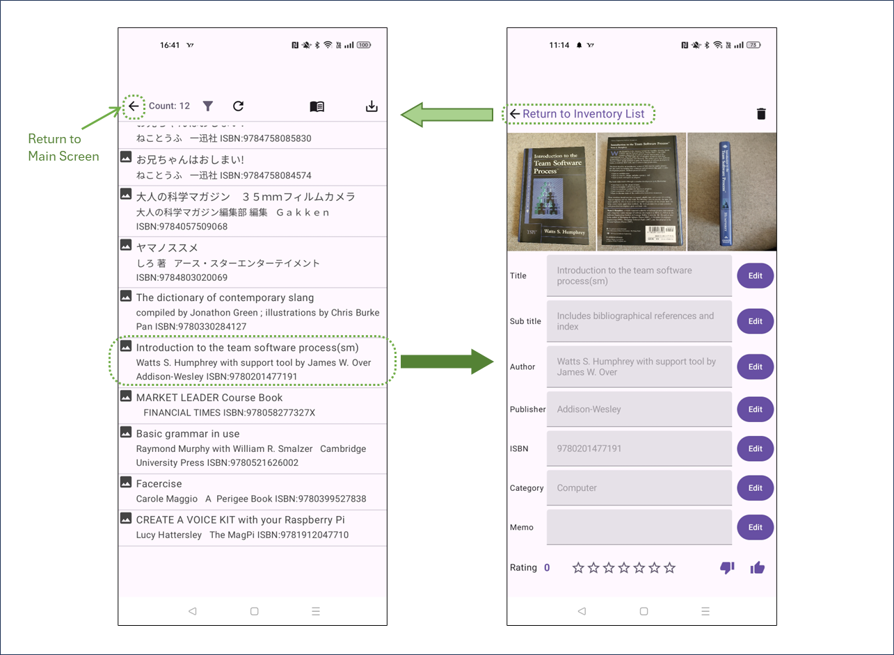

フィルタアイコンをタッチすると、一覧に表示する内容をフィルタリングすることができます。リロードボタンで、フィルタリングの解除ができます。

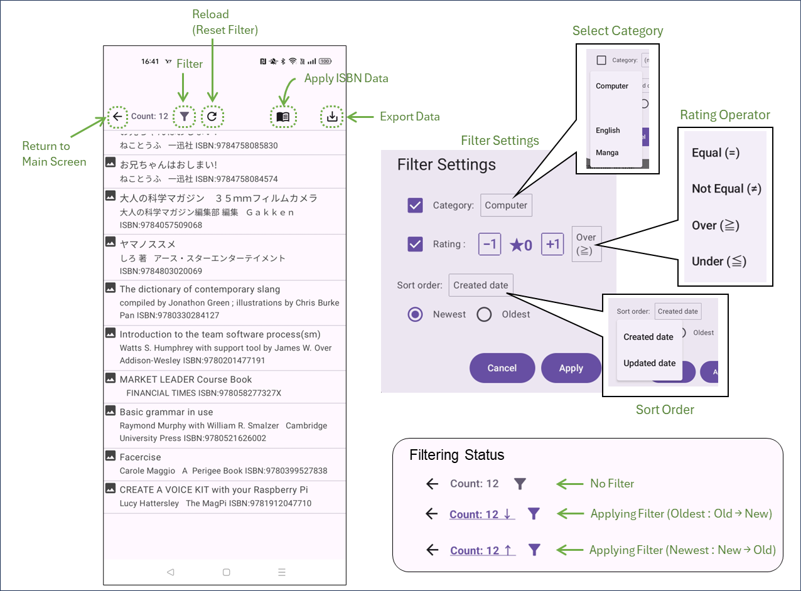

本のアイコンを押すと、登録されているデータのISBN番号でデータ更新することができます。

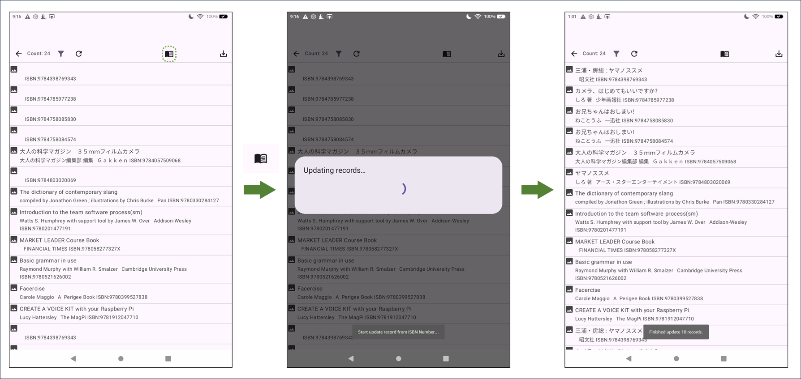

エクスポートボタンを押すと、**（フィルタ表示されているデータとは関係なく）登録されている全データをエクスポートすることができます。**

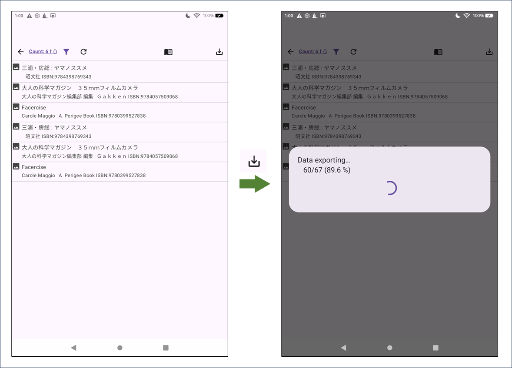

### 詳細画面 (Detail Screen)

登録したデータを確認できる画面です。

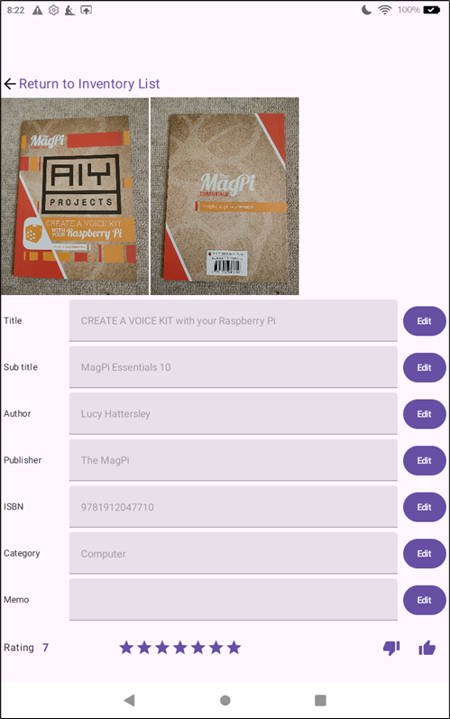

「編集(Edit)」ボタンで、データの編集ができます。編集を終了した後、「更新(Update)」ボタンでデータを更新します。

**「更新(Update)」ボタンを押さずに一覧画面に戻ると、編集したデータは更新されませんので、ご注意ください。**

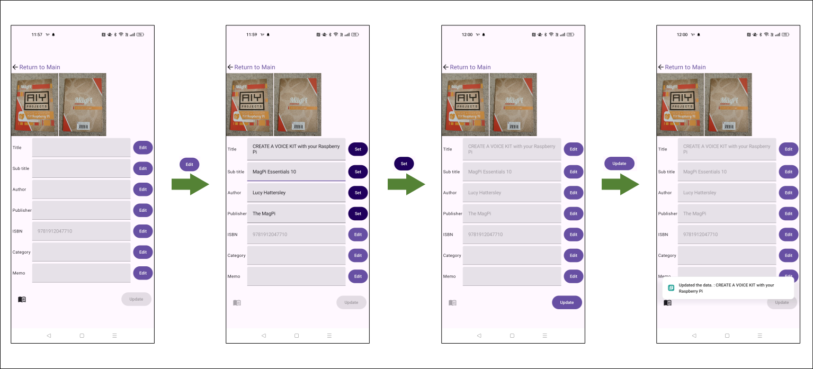

本のアイコンを押すと、題名や著者、出版社などの情報をISBN番号から検索し、更新することができます。
（データの取得先は国立国会図書館のデータベースです。）

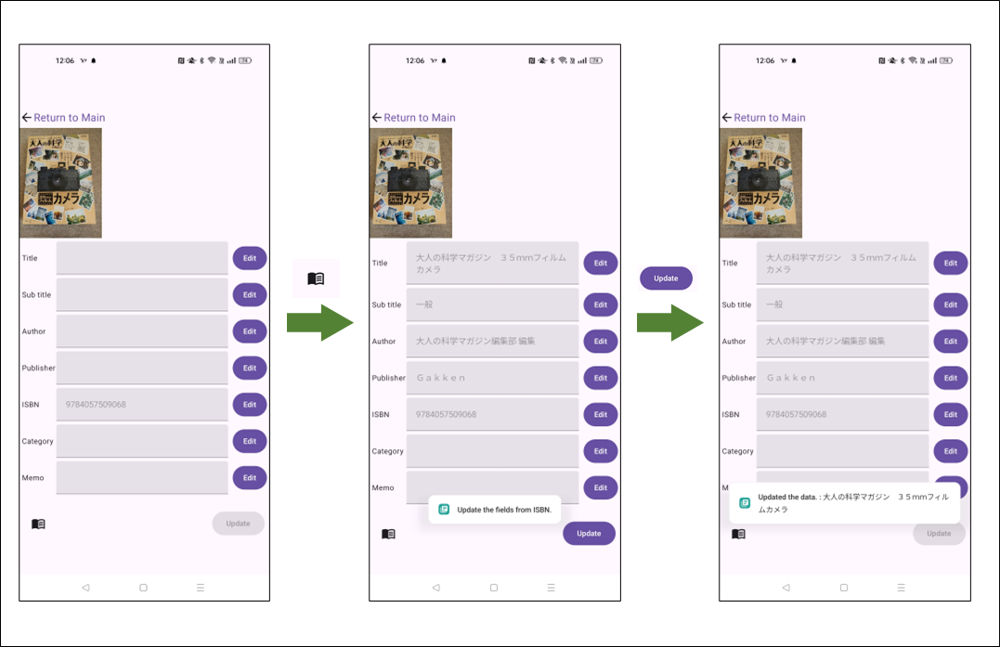

詳細画面では登録時のデータだけでなく、追加で「メモ(MEMO)」や「評価(Rate)」を登録することができます。

評価は、0～7の８段階の値が設定できます。★の数（1～7）で評価を表示します。

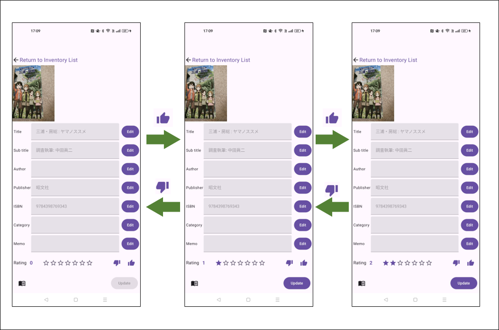

評価で、1～7を設定すると一覧画面の末尾に(★n)という形式で評価の表示します。

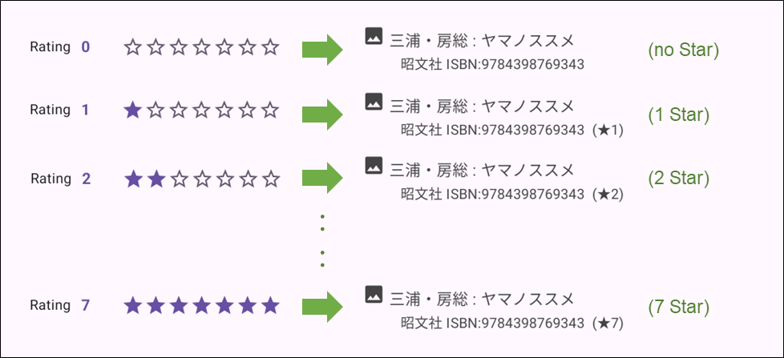

### 登録画面 (Register Screen)

データを登録する画面です。カメラで書影やバーコードなどの読み出し・記録ができます。　画像は最大３枚記録することができます。

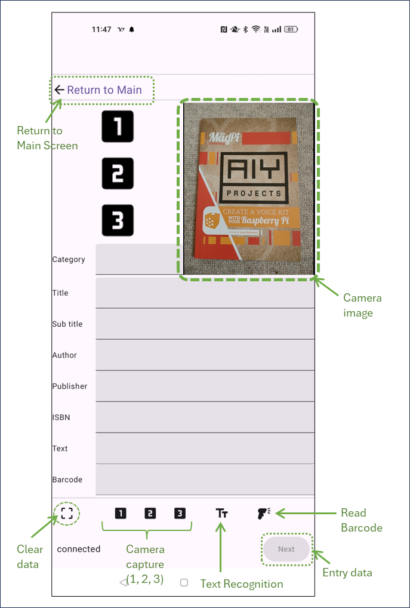

バーコードを読み出すと、「バーコード」および「ISBN」の値を更新します。

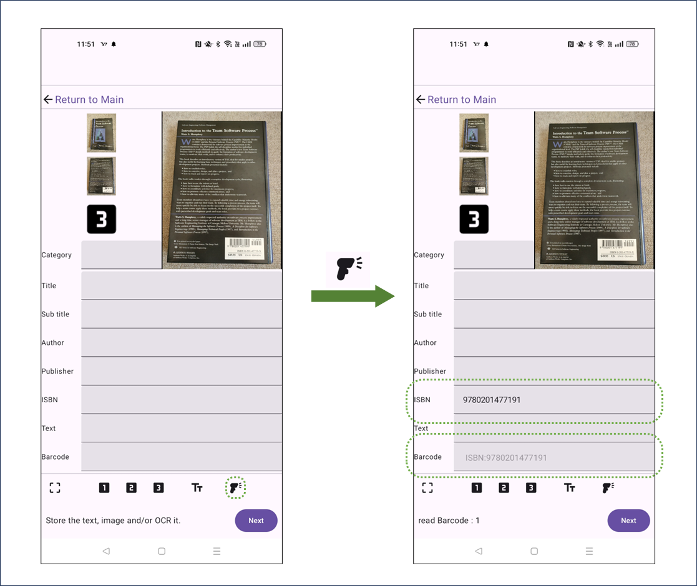

なお、登録すると、登録したデータは消去されて次のデータ登録に写りますが、 **「カテゴリ」だけは消えずに残りますので、ご注意ください。**

（同じカテゴリのアイテムを連続登録する想定での仕様です。）

### インポート画面 (Import Screen)

本アプリでエクスポートしたデータ（「１つのファイルにまとめてエクスポート」がONの状態でエクスポートしたzip形式のファイル）を、インポートすることができます。

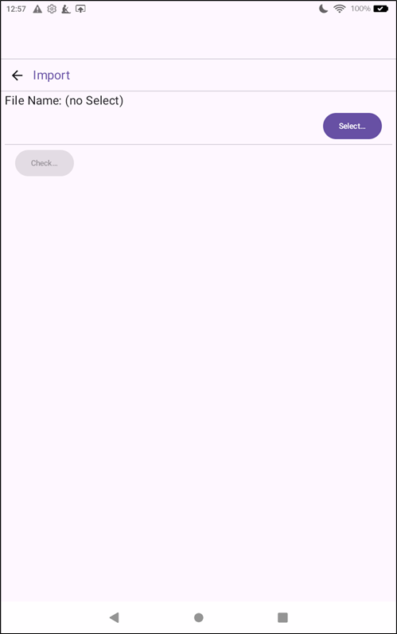

インポート操作は、まずエクスポートしたデータを選択し、「確認...」を行います。
本アプリでエクスポートしたデータであれば、データを登録するかどうか確認するダイアログが表示されますので、登録を実行してください。

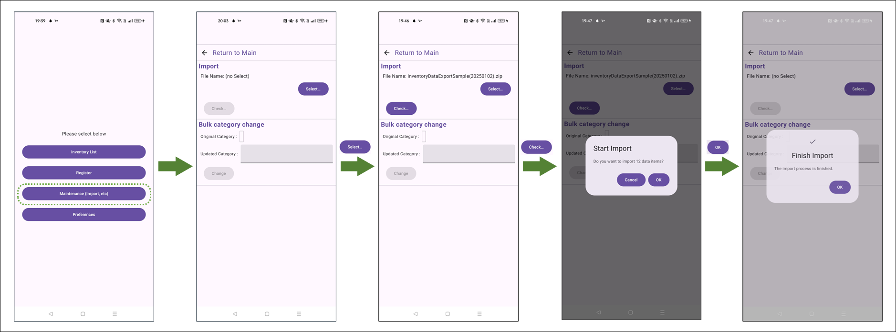

### 設定画面 (Preferences Screen)

アプリの振る舞いを変える、いくつかのスイッチ、及び、操作説明（本ページ）やプライバシーポリシーへのリンクがあります。

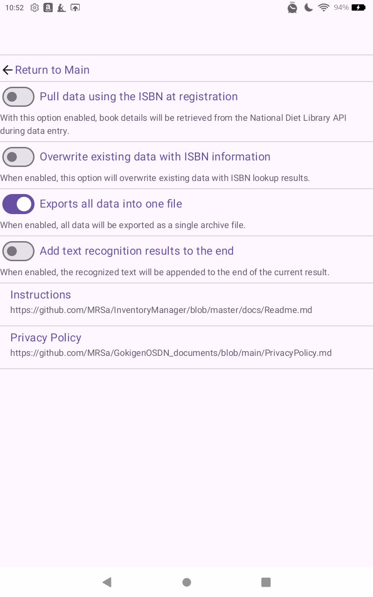

* **データ登録時にISBNから情報を取得する**
  * 本スイッチをONにすると、登録画面で、データ登録時（「次の登録へ(Next)」を押した直後）に、ISBN番号が記録されていた場合は、ISBN番号を基に、題名・副題・作者・会社のデータを検索し登録します。
* **ISBNで取得した情報でデータを上書きする**
  * このスイッチがOFFとなっている場合、ISBN番号で情報を検索し取得できたとしても、既に題名・副題・作者・課題が入力されていた場合には、データの更新を行いません。ONになっている場合は、ISBN番号で検索した値で、題名・副題・作者・会社のデータを更新（上書き）します。
* **１つのファイルにまとめてエクスポート**
  * **このスイッチは標準でONとなっています。** ONの場合は、エクスポートを指示した場合、１つのファイルに画像ファイルとJSON形式のデータをまとめて出力します。OFFの場合は、JSON形式のデータと画像データを別々の場所(Download/ と Pictures/ の下)に出力します。
* **操作説明**
  * [本ページ](https://github.com/MRSa/InventoryManager/blob/master/docs/Readme.md)へのリンクです。
* **プライバシーポリシー**
  * [プライバシーポリシー](https://github.com/MRSa/GokigenOSDN_documents/blob/main/PrivacyPolicy.md)へのリンクです。

## その他

### エクスポートファイルの出力先

設定画面のスイッチ「１つのファイルにまとめてエクスポート」が ON と OFF で、ファイルの出力先が異なります。

* 「1つのファイルにまとめてエクスポート」が ON の場合
  * Download/ の下に サブフォルダ inventoryYYYYMMDD_hhmmss/ (YYYYMMDD_hhmms は、年月日_時分秒)　を作成し、その中に zip形式のファイル、inventoryDataExport.json.zip を出力します。

* 「1つのファイルにまとめてエクスポート」が OFF の場合
  * Download/ の下に サブフォルダ inventoryYYYYMMDD_hhmmss/ (YYYYMMDD_hhmms は、年月日_時分秒)　を作成し、その中に json形式のファイル、inventoryDataExport.json を出力します。
  * Pictures/ の下に サブフォルダ inventoryYYYYMMDD_hhmmss/ (YYYYMMDD_hhmms は、年月日_時分秒)　を作成し、さらにその下に 数字/数字_imgXX.jpg (XXは、01 ～ 05)のJPEG形式のファイルを出力します。

## ソースコード

ソースコードは、以下の場所で管理しています。

* https://github.com/MRSa/InventoryManager.git
