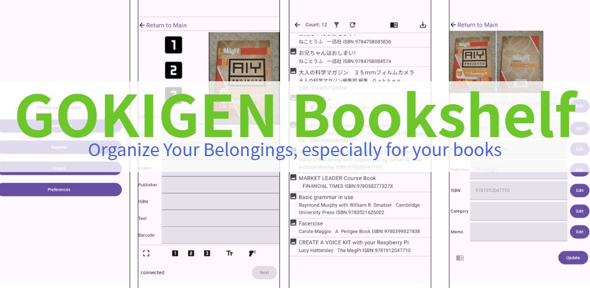
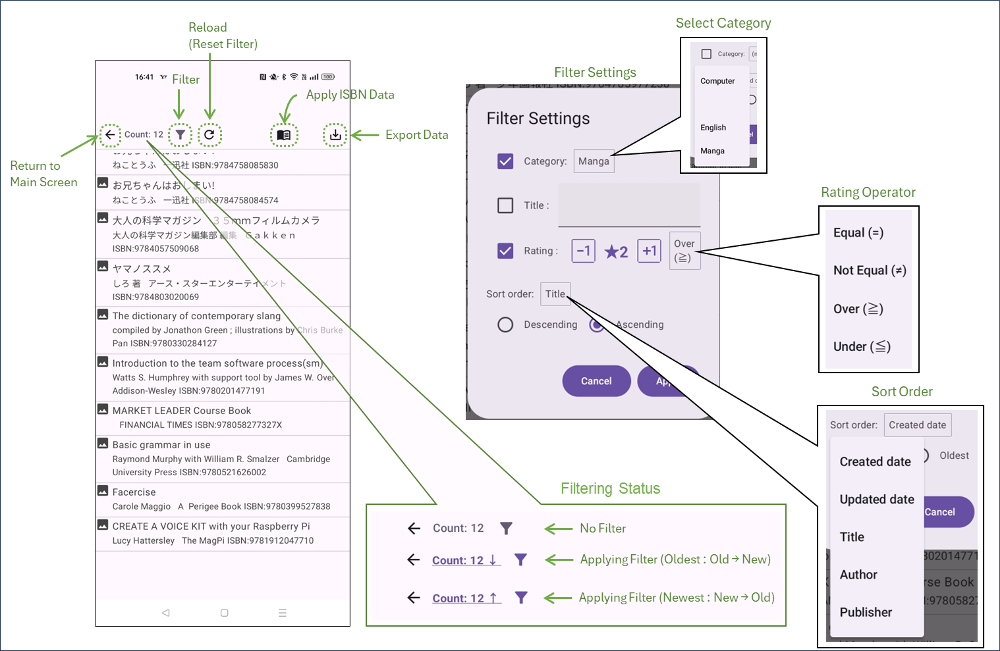
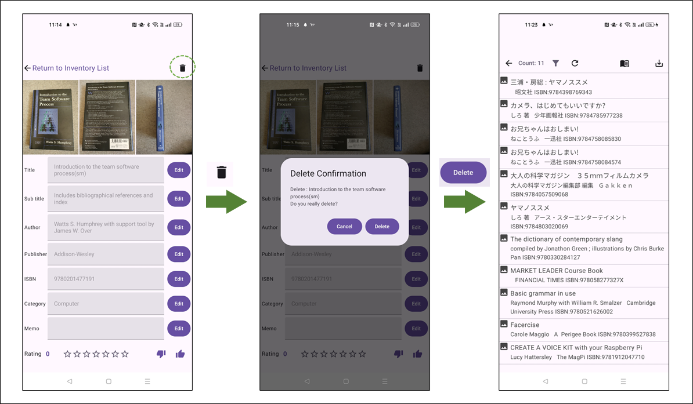
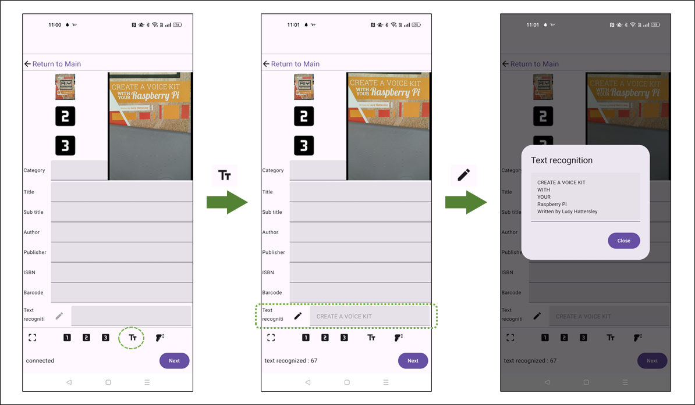
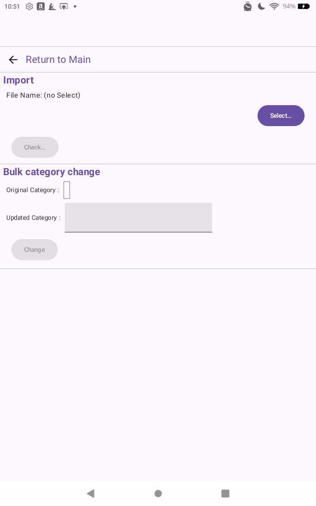

# ごきげん本棚 : 本（または自分の所有物）を管理する Androidアプリケーション

「ごきげん本棚」は、本やその他の所有物を管理するAndroidアプリケーションです。アイテムの情報を登録するだけでなく、メモや８段階の評価を記録することができます。
「ごきげん本棚」の機能は、ISBN番号の問い合わせで情報を取得する以外は、端末上で完結するようなつくりになっており、登録したデータを外部送信することはありません。

-----

- [ごきげん本棚 : 本（または自分の所有物）を管理する Androidアプリケーション](#ごきげん本棚--本または自分の所有物を管理する-androidアプリケーション)
  - [スクリーンショット](#スクリーンショット)
  - [機能概要](#機能概要)
  - [インストール](#インストール)
  - [画面遷移](#画面遷移)
  - [画面説明](#画面説明)
    - [メイン画面 (Main Screen)](#メイン画面-main-screen)
    - [一覧画面 (Inventory List Screen)](#一覧画面-inventory-list-screen)
    - [詳細画面 (Detail Screen)](#詳細画面-detail-screen)
    - [登録画面 (Register Screen)](#登録画面-register-screen)
    - [メンテナンス画面 (Maintenance Screen)](#メンテナンス画面-maintenance-screen)
      - [データの一括取り込み（インポート）](#データの一括取り込みインポート)
      - [カテゴリの一括変更](#カテゴリの一括変更)
    - [設定画面 (Preferences Screen)](#設定画面-preferences-screen)
  - [その他](#その他)
    - [エクスポートファイルの出力先](#エクスポートファイルの出力先)
  - [ソースコード](#ソースコード)
  - [ライセンス](#ライセンス)

-----

## スクリーンショット

-----

## 機能概要

- アイテムの登録
  - アイテムの登録
  - カメラを使った書影の記録、バーコードの読み出し、文字認識
- 登録データの管理
  - 登録したアイテムの一覧表示
  - 一覧のフィルタリング
  - 登録データの詳細確認
  - アイテムのISBN番号を使って国立国会図書館に登録されている情報で更新
  - アイテムの評価（8段階）、メモの記録
- データのインポート/エクスポート
  - 登録した全データのエクスポート
  - エクスポートしたデータのインポート

-----

## インストール

本アプリは、Google Play で配布しています。[Google Playよりインストール](https://play.google.com/store/apps/details?id=jp.osdn.gokigen.inventorymanager)してください。

- https://play.google.com/store/apps/details?id=jp.osdn.gokigen.inventorymanager

-----

## 画面遷移

以下に画面遷移を示します。アプリ起動直後は、メイン画面を表示します。

使用する機能によって、画面を選択してください。

-----

## 画面説明

### メイン画面 (Main Screen)

起動直後に表示する画面です。各画面に遷移する起点の画面です。

### 一覧画面 (Inventory List Screen)

登録済のデータ一覧を表示する画面です。

リストをタッチすると、詳細画面に遷移します。『←』ボタンで、メイン画面に戻ることができます。

フィルタアイコンをタッチすると、一覧に表示する内容をフィルタリングすることができます。リロードボタンで、フィルタリングの解除ができます。

フィルタリングは、「カテゴリ」と「評価」と「題名」で、また、データ登録順、データ更新順、題名、作者、会社名で並べ替えの設定が可能です。
なお、「題名」は部分一致、「評価」は評価値の一致(＝)、以外(≠)、以上(≧)、以下(≦)でフィルタリングの設定ができます。

本のアイコンを押すと、登録されているデータについて、登録されているISBN番号がある場合、そのデータを参照して一括更新することができます。

エクスポートボタンを押すと、**（フィルタ表示されているデータとは関係なく）登録されている全データをエクスポートすることができます。**

### 詳細画面 (Detail Screen)

登録したデータを確認できる画面です。

「編集(Edit)」ボタンで、データの編集ができます。編集を終了した後、「更新(Update)」ボタンでデータを更新します。
**「更新(Update)」ボタンを押さずに一覧画面に戻ると、編集したデータは更新されませんので、ご注意ください。**

本のアイコンを押すと、題名や著者、出版社などの情報をISBN番号から検索し、更新することができます。
（データの取得先は国立国会図書館のデータベースです。）

詳細画面では登録時のデータだけでなく、追加で「メモ(MEMO)」や「評価(Rate)」を登録することができます。

評価は、0～7の８段階の値が設定できます。★の数（1～7）で評価を表示します。

評価で、1～7を設定すると一覧画面の末尾に(★n)という形式で評価の表示します。

右上の「ゴミ箱」ボタンで、表示中のデータを削除することができます。

繰り返しになりますが、「更新(Update)」ボタンを押さずに一覧画面に戻ると、編集したデータは更新されませんので、ご注意ください。

### 登録画面 (Register Screen)

データを登録する画面です。カメラで書影やバーコードなどの読み出し・記録ができます。　画像は最大３枚記録することができます。
なお、バーコードスキャンや文字認識に使用した画像はこの３枚とは別に保存しますので、１件につき最大５枚の画像データを保存できます。
なお、登録すると、登録したデータは消去されて次のデータ登録に写りますが、 **「カテゴリ」だけは消えずに残りますので、ご注意ください。**

（同じカテゴリのアイテムを連続登録する想定での仕様です。）

バーコードを読み出すと、「バーコード」および「ISBN」の値を更新します。

文字認識を実行することもできます。文字認識結果の詳細は、ダイアログで表示・編集ができます。

### メンテナンス画面 (Maintenance Screen)

メンテナンス画面では、本アプリでエクスポートしたデータ（「１つのファイルにまとめてエクスポート」がONの状態でエクスポートしたzip形式のファイル）を一括取り込み（インポート）する機能、
カテゴリの一括変更機能を提供します。

#### データの一括取り込み（インポート）

「選択...」ボタンを押し、エクスポートしたデータを選択してください。選択後、「確認...」ボタンが有効になります。
「確認...」ボタンを押して、選択したファイルの内容確認を行い、本アプリでエクスポートしたデータと判断すれば、データを登録するかどうか確認するダイアログが表示されますので、「OK」ボタンを押して登録を実行してください。

操作例")

#### カテゴリの一括変更

登録されているデータのカテゴリを一括変更することができます。変更したいカテゴリを選択し、変更後のカテゴリを指定した後、「一括変更」ボタンを押してください。

### 設定画面 (Preferences Screen)

アプリの振る舞いを変える、いくつかのスイッチ、及び、操作説明（本ページ）やプライバシーポリシーへのリンクがあります。

- **データ登録時にISBNから情報を取得する**
  - 本スイッチをONにすると、登録画面で、データ登録時（「次の登録へ(Next)」を押した直後）に、ISBN番号が記録されていた場合は、ISBN番号を基に、題名・副題・作者・会社のデータを検索し登録します。
- **ISBNで取得した情報でデータを上書きする**
  - このスイッチがOFFとなっている場合、ISBN番号で情報を検索し取得できたとしても、既に題名・副題・作者・課題が入力されていた場合には、データの更新を行いません。ONになっている場合は、ISBN番号で検索した値で、題名・副題・作者・会社のデータを更新（上書き）します。
- **１つのファイルにまとめてエクスポート**
  - **このスイッチは標準でONとなっています。** ONの場合は、エクスポートを指示した場合、１つのファイルに画像ファイルとJSON形式のデータをまとめて出力します。OFFの場合は、JSON形式のデータと画像データを別々の場所(Download/ と Pictures/ の下)に出力します。
- **文字認識結果を消さずに末尾へ追加**
  - このスイッチをONにすると、文字認識を複数回実施した場合、前回の文字認識結果を消さずに末尾にどんどんつなげていくようになります。
- **操作説明**
  - [本ページ](https://github.com/MRSa/InventoryManager/blob/master/docs/Readme.md)へのリンクです。
- **プライバシーポリシー**
  - [プライバシーポリシー](https://github.com/MRSa/GokigenOSDN_documents/blob/main/PrivacyPolicy.md)へのリンクです。

-----

## その他

### エクスポートファイルの出力先

設定画面のスイッチ「１つのファイルにまとめてエクスポート」が ON と OFF で、ファイルの出力先が異なります。

- 「1つのファイルにまとめてエクスポート」が ON の場合
  - Download/ の下に サブフォルダ gokigen_bookshelf_YYYYMMDD_hhmmss/ (YYYYMMDD_hhmms は、年月日_時分秒)　を作成し、その中に zip形式のファイル、GokigenBookshelfExport.json.zip を出力します。
   zip形式のファイルの中には、JSON形式のデータファイルと、画像ファイルがアーカイブされています。

- 「1つのファイルにまとめてエクスポート」が OFF の場合
  - Download/ の下に サブフォルダ gokigen_bookshelf_YYYYMMDD_YYYYMMDD_hhmmss/ (YYYYMMDD_hhmms は、年月日_時分秒)　を作成し、その中に json形式のファイル、GokigenBookshelfExport.json を出力します。
  - Pictures/ の下に サブフォルダ gokigen_bookshelf_YYYYMMDD_YYYYMMDD_hhmmss/ (YYYYMMDD_hhmms は、年月日_時分秒)　を作成し、さらにその下に 数字/数字_imgXX.jpg (XXは、01 ～ 05)のJPEG形式のファイルを出力します。

## ソースコード

ソースコードは、以下の場所で管理しています。

- [https://github.com/MRSa/InventoryManager.git](https://github.com/MRSa/InventoryManager.git)

## ライセンス

- [https://github.com/MRSa/InventoryManager/blob/master/LICENSE.txt](https://github.com/MRSa/InventoryManager/blob/master/LICENSE.txt)
