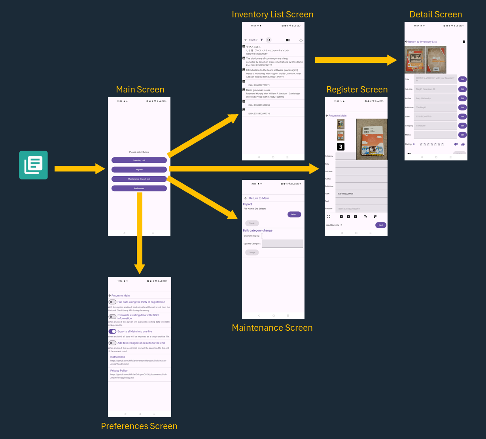

# InventoryManager: 本（または自分の所有物）を管理する Androidアプリケーション

InventoryManagerは、本やその他の所有物を管理するAndroidアプリケーションです。

## スクリーンショット

## 機能概要

* アイテムの登録
    * アイテムの登録
    * カメラを使った書影の記録、バーコードの読み出し、文字認識
* 登録データの管理
    * 登録したアイテムの一覧表示
    * 一覧のフィルタリング
    * 登録データの詳細確認、メモやレーティングの記録
    * アイテムのISBN番号を使って国立国会図書館に登録されている情報で更新
* データのインポート/エクスポート
    * 登録した全データのエクスポート
    * エクスポートしたデータのインポート

## インストール

（登録方法 検討中）

## 画面遷移

### メイン画面 (Main Screen)

### 一覧画面 (Inventory List Screen)

### 詳細画面 (Detail Screen)

### 登録画面 (Register Screen)

### インポート画面 (Import Screen)

### 設定画面 (Preferences Screen)

