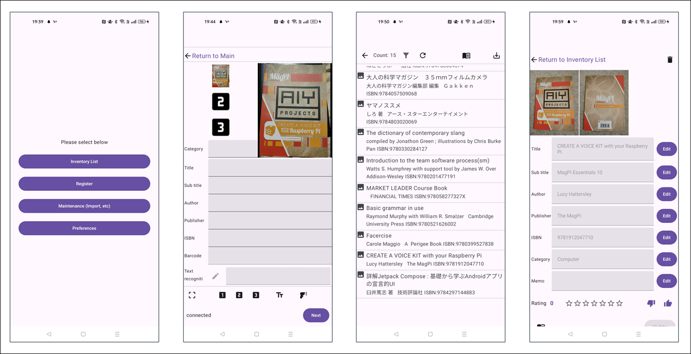

# InventoryManager: 本（または自分の所有物）を管理する Androidアプリケーション

InventoryManagerは、本やその他の所有物を管理するAndroidアプリケーションです。

## スクリーンショット

## 機能概要

* アイテムの登録
    * アイテムの登録
    * カメラを使った書影の記録、バーコードの読み出し、文字認識
* 登録データの管理
    * 登録したアイテムの一覧表示
    * 一覧のフィルタリング
    * 登録データの詳細確認、メモやレーティングの記録
    * アイテムのISBN番号を使って国立国会図書館に登録されている情報で更新
* データのインポート/エクスポート
    * 登録した全データのエクスポート
    * エクスポートしたデータのインポート

## インストール

（登録方法 検討中）

## 画面遷移

以下に画面遷移を示します。アプリ起動直後は、メイン画面を表示します。

必要な機能に合わせ、画面を切り替えてください。

## 画面説明

### メイン画面 (Main Screen)

起動直後に表示する画面です。各画面に遷移する起点の画面です。

### 一覧画面 (Inventory List Screen)

登録済のデータ一覧を表示する画面です。

リストをタッチすると、詳細画面に遷移します。『←』ボタンで、メイン画面に戻ることができます。

フィルタアイコンをタッチすると、一覧に表示する内容をフィルタリングすることができます。リロードボタンで、フィルタリングの解除ができます。

本のアイコンを押すと、登録されているデータのISBN番号でデータ更新することができます。

エクスポートボタンを押すと、**（フィルタ表示されているデータとは関係なく）登録されている全データをエクスポートすることができます。**

### 詳細画面 (Detail Screen)

登録したデータを確認できる画面です。

「編集(Edit)」ボタンで、データの編集ができます。編集を終了した後、「更新(Update)」ボタンでデータを更新します。

「更新(Update)」ボタンを押さずに一覧画面に戻ると、編集したデータは更新されませんので、ご注意ください。

詳細画面では登録時のデータだけでなく、追加で「メモ(MEMO)」や「評価(Rate)」を登録することができます。

評価は、0～7の８段階の値が設定できます。★の数（1～7）で評価を表示します。

評価で、1～7を設定すると一覧画面の末尾に(★n)という形式で評価の表示します。

### 登録画面 (Register Screen)

データを登録する画面です。カメラで書影やバーコードなどの読み出し・記録ができます。　画像は最大３枚記録することができます。

バーコードを読み出すと、「バーコード」および「ISBN」の値を更新します。

なお、登録すると、登録したデータは消去されて次のデータ登録に写りますが、 **「カテゴリ」だけは消えずに残りますので、ご注意ください。**

（同じカテゴリのアイテムを連続登録する想定での仕様です。）

### インポート画面 (Import Screen)

### 設定画面 (Preferences Screen)

## その他

## ソースコード

* https://github.com/MRSa/InventoryManager.git
